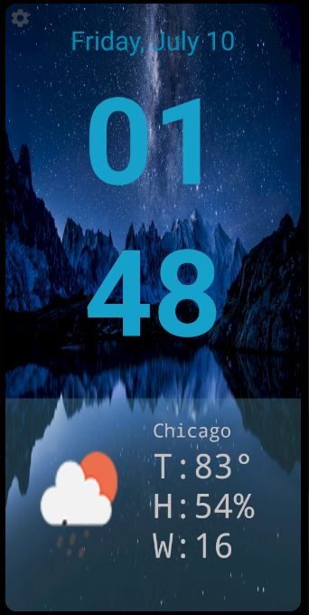
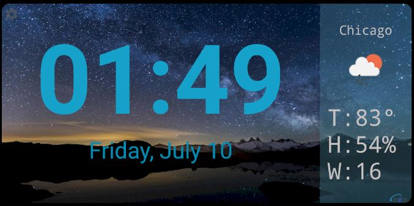
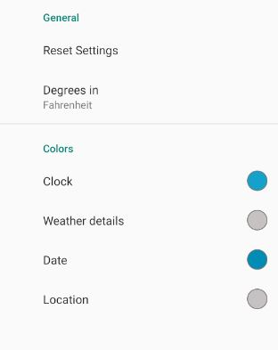

# PermanentClock
My first android app! I wanted to use an old android phone I had as a digital smart clock in my room and couldn't find any that I liked, so I made my own.  

## Features
- separate landscape and portrait layouts
- settings to control colors of text and temperature units
- uses openweathermap to retrieve the current weather
- automatically detects current location
- 'always on' feature (i.e screen will not shutoff)

# Screenshots

# Notes
If you want to use this, make sure to add your own api key for openweathermap to the strings.xml file